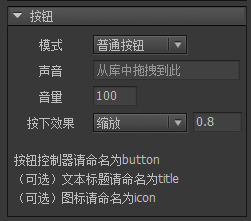

按钮是FairyGUI里最常用的扩展组件。他用于多个用途，例如传统UI框架中的RadioButton、Checkbox、List Item等，在FairyGUI里通通都是按钮。

## 创建按钮

可以通过两种方式创建按钮组件。

- 点击主菜单“资源”->“新建按钮”，按照向导的提示一步步完成。


- 新建一个组件，然后在组件属性里选择扩展为“按钮”。然后创建一个控制器，点击“按钮模板”，选择一个按钮模板。

## 设计属性

在组件编辑状态下，按钮组件的属性面板是：



- `模式` 有三种按钮模式选择。
 - `普通按钮` 用于点击->响应的用途，无状态。
 - `单选按钮` 有一个是否选中的状态。被点击后处于选中状态，再点击仍然保持选中状态。
 - `复选按钮` 有一个是否选中的状态。被点击后处于选中状态，再点击则变成不选中状态。

- `声音` 设置按钮被点击时的音效。如果所有按钮都共用一种音效，不需要每个按钮设置，在项目属性对话框里有一个全局的设置。

- `音量` 设置按钮点击音效的播放音量。0-100。

- `按下效果` 用控制器可以随意控制按钮在不同页面的形态，但出于方便，内置了几种常用的按钮按下效果。
 - `缩放` 按下时按钮变大或变小。按下缩放是通过改变按钮组件的ScaleX和ScaleY实现的。注意：设置了按下缩放后，按钮初始化时会自动将轴心设置为（0.5，0.5）。
 - `变暗` 按下时按钮呈现变暗的状态。变暗实际是通过改变按钮组件内所有图片的颜色实现的。如果你还有对按钮内图片的颜色的单独设置，这可能会发生冲突。

**命名约定**

- `button` 按钮控制器必须命名为“button”，如果你不需要按钮有特殊效果，那么这个控制器不是必须的。

按钮控制器各个页面的说明：

`up` 按钮正常的状态；
`down` 普通按钮按下时的状态/单选或多选按钮被选中时的状态；
`over` 当鼠标指针悬浮在按钮上方时的状态；
`selectedOver` 当单选或多选按钮选中时，鼠标指针悬浮到按钮上方时的状态；
`disabled` 按钮不可用时的状态；
`selectedDisabled` 当单选或多选按钮选中时，按钮不可用时的状态。

通常我们设计一个4态按钮，用up/down/over/selectedOver就可以了，如果是用在移动设备上，那么使用up/down就可以了。当按钮不可用时，FairyGUI提供了一个默认的变灰的效果，如果你不想要这个效果，那就要用到disabled和selectedDisabled进行设计。

- `title` 可以是普通文本，富文本，也可以是标签、按钮。

- `icon` 可以是装载器，也可以是标签、按钮。

注意：按钮组件内并非只能有“title”和“icon”，你可以放置任何元件，例如放置任意多的文本、装载器等。“title”和“icon”的设定只是用于按钮组件在编辑器实例化时能够直观设置而已。

## 实例属性

在舞台上选中一个按钮组件，右边的属性面板列表出现：


- `状态` 单选按钮或多选按钮可以设置按钮是否处于选中状态。

- `标题` 设置的文本将赋值到标签组件内的“title”元件的文本属性。如果不存在“title”元件，则什么事都不会发生。

- `选中时标题` 当按钮处于选中状态时，设置标题属性为这里设置的值；当按钮处于不选中状态时，恢复原标题属性的值。

- `标题颜色` 默认的标题颜色是标签组件内的“title”元件的文字颜色，勾选后，可以修改文字颜色。如果不存在“title”元件，则什么事都不会发生。

- `字体大小` 默认的字体大小是标签组件内的“title”元件的字体大小，勾选后，可以修改字体大小。如果不存在“title”元件，则什么事都不会发生。

- `图标` 设置的URL将赋值到标签组件内的“icon”元件的图标属性。如果不存在“icon”元件，则什么事都不会发生。

- `选中时图标` 当按钮处于选中状态时，设置图标属性为这里设置的值；当按钮处于不选中状态时，恢复原图标属性的值。

- `点击声音` 勾选后可以重新设置按钮的点击音效，覆盖按钮在设计期的设置。

- `音量` 设置按钮点击音效的播放音量。0-100。

- `连接` 控制器可以与按钮联动。请参阅[控制器](controller.html#和按钮的联动)

## GButton

设置按钮的标题或者图标，你甚至不需要强制对象为GButton的类型，直接用GObject提供的接口就可以，例如：

```csharp
    GObject obj = gcom.GetChild("n1");
    obj.text = "hello";
    obj.icon = "ui://包名/图片名";   
```

如果是单选或者多选按钮，下面的方法设置是否选中：

```csharp
    GButton button = gcom.GetChild("n1").asButton;
    button.selected = true;
```

通常对于单选/多选按钮，用户点击后就能切换状态。如果你不需要这样，希望只能通过API改变状态，那么可以：

```csharp
    //关闭后你只能通过改变selected属性修改按钮状态，用户点击不会改变状态。
    button.changeStateOnClick = false;
```

通过代码设置按钮与控制器的联动的方式是：

```csharp
    button.pageOption.controller = aController;
    button.pageOption.index = 1; //通过索引设置
    button.pageOption.name = "page_name"; //或通过页面名称设置
```

按钮可以模拟触发点击：

```csharp
    //模拟触发点击，只会有一个触发的表现，以及改变按钮状态，不会触发侦听按钮的点击事件。
    button.FireClick(true);

    //如果同时要触发点击事件，需要额外调用：
    button.onClick.Call();
```

按钮全局声音的设置为：

```csharp
    //Unity版本要求一个AudioClip对象，如果是使用库里面的资源，那么可以使用：
    UIConfig.buttonSound = (AudioClip)UIPackage.GetItemAssetByURL("ui://包名/声音名");

    //其他版本要求一个资源url，即：
    UIConfig.buttonSound = "ui://包名/声音名";

    //全局音量    
	UIConfig.buttonSoundVolumeScale = 1f;
```

单选和多选按钮状态改变时有通知事件：

```csharp
    //Unity
    button.onChanged.Add(onChanged);

    //AS3
    button.addEventListener(StateChangeEvent.CHANGED, onChanged);

    //Egret
    button.addEventListener(StateChangeEvent.CHANGED, this.onChanged, this);

    //Laya
    button.on(fairygui.Events.STATE_CHANGED, this, this.onChanged);
```