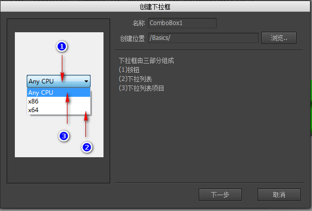
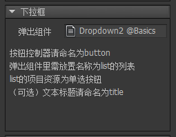
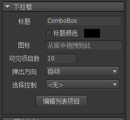

## 创建下拉框

可以通过两种方式创建下拉框组件。

- 点击主菜单“资源”->“新建下拉框”，然后按照向导的提示一步步完成。



- 新建一个组件，然后在组件属性里选择扩展为“下拉框”。

## 设计属性

在组件编辑状态下，下拉框组件的属性面板是：



- `弹出组件` 下拉框在选项弹出时需要用到的组件。


这个组件最基本的设计就是一个背景+一个列表。背景对容器组件做好宽高关联。列表需要命名为“list”，并设置好“项目资源”，一般来说，列表的“溢出处理”都设置为“垂直滚动”。列表不需要建立任何关联。

当下拉框需要弹出下拉列表时，会将弹出组件的宽度设置成下拉框的宽度，然后填充列表数据，并按照“可见项目数量”的要求调整列表高度，最后显示出来。

**命名约定**

- `button` 下拉框也需要一个按钮控制器，因为他和按钮的形态是一样的。可以按设计按钮的方式设计下拉框。当下拉框被点击下拉时，“button”控制器将停留在“down”页，下拉列表收回后，“button”控制器回到“up”页或“over”页。
- 
- `title` 可以是普通文本，富文本，也可以是标签、按钮。

- `icon` 可以是装载器，也可以是标签、按钮。
- 
## 实例属性

在舞台上选中一个下拉框组件，右边的属性面板列表出现：



- `标题` 设置的文本将赋值到标签组件内的“title”元件的文本属性。如果不存在“title”元件，则什么事都不会发生。

- `图标` 设置的URL将赋值到标签组件内的“icon”元件的图标属性。如果不存在“icon”元件，则什么事都不会发生。

- `可见项目数量` 下拉显示时最多显示的项目数量。例如，如果这里设置的值为10，而下拉框的数据有100条，那么下拉列表的视口会调整到只显示10条，其他需要滚动查看。

- `弹出方向` 下拉列表的弹出方向。

- `选择控制` 可以绑定一个控制器。这样当下拉框选择发生改变时，控制器也同时跳转到相同索引的页面。反之亦然，如果控制器跳转到某个页面，那么下拉框也同时选定相同索引的项目。

- `编辑列表项目` 点击后弹出对话框，可以编辑下拉列表的项目：


- `文本` 设置这个列表项目的标题。

- `图标` 设置这个列表项目的图标。

- `值` 设置这个列表项目的value属性。用途可参考下面API的说明。

## GComboBox

我们可以在编辑器编辑下拉列表的项目，也可以用代码动态设置，例如：

```csharp
    GComboBox combo = gcom.GetChild("n1").asComboBox;

    //items是列表项目标题的数组。
    combo.items = new string[] { "Item 1", "Item 2", ...};

    //values是可选的，代表每个列表项目的value。
    combo.values = new string[] { "value1", "value2", ...};

    //获得当前选中项的索引
    Debug.Log(combo.selectedIndex);

    //获得当前选中项的value。
    Debug.Log(combo.value);

    //设置选中项，通过索引
    combo.selectedIndex = 1;

    //设置选中项，通过value
    combo.value = "value1";
```

下拉框选择改变时有通知事件：

```csharp
    //Unity
    combo.onChanged.Add(onChanged);

    //AS3
    combo.addEventListener(StateChangeEvent.CHANGED, onChanged);

    //Egret
    combo.addEventListener(StateChangeEvent.CHANGED, this.onChanged, this);

    //Laya
    combo.on(fairygui.Events.STATE_CHANGED, this, this.onChanged);
```