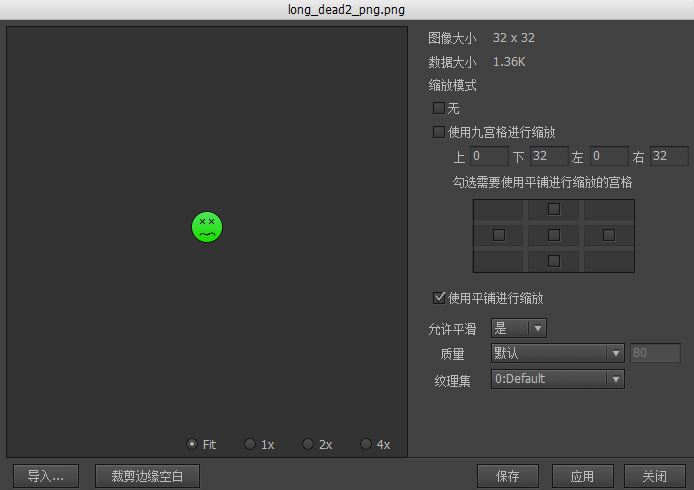
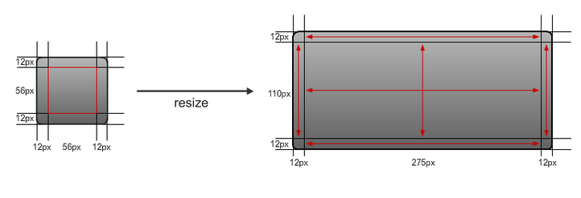
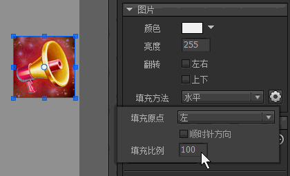
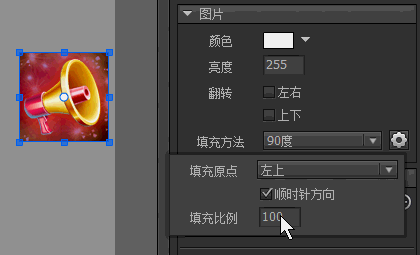

## 图片属性

在资源库中，或者舞台上，双击图片，进入图片属性设置对话框：



- `图像大小` 图片的尺寸，像素大小。

- `数据大小` 图片文件的大小，单位字节。如果出现有 xxx->xxx的字样，表示该图片被压缩过，前面数字是压缩前大小，后面的数字是压缩后大小。

- `使用九宫格进行缩放` 九宫格绘制会遵循下面的规则：
a. 保持4个角部分不变形
b. 单向拉伸4条边（即在4个角两两之间的边，比如上边，只做横向拉伸）
c. 双向拉伸中间部分（即九宫格的中间部分，横向，纵向同时拉伸，PS：拉伸比例不一定相同）


（图片来自www.cocoachina.com）

如果你想九宫格中被拉伸的部分改用平铺进行填充，可以在下图的界面内勾选这些宫格：

<center>

</center>

- `使用平铺进行缩放` 图片拉伸时使用平铺模式进行填充。除了Flash和Haxe版本，应该尽量避免使用较小面积的图片平铺填充到较大的面积，因为这样会产生大量的网格，甚至可能溢出报错。如果你确实有这个需求，Unity版本提供了一种优化策略，你需要将这个图片设置为单独导出（下面的纹理集设置会说明），然后在Unity编辑器中，将这张纹理的Wrap Mode设置为Repeat。满足这两个条件后，使用这个图片进行平铺填充的性能会大大提高，而且不会出现溢出的异常。

- `允许平滑`	这个选项适用于Flash和Starling版本。它指示图片在拉伸时是否进行平滑处理。如果这个图片是用在制作像素游戏里的角色，你可能需要关闭平滑，其他情况一般都应开启。

- `质量` 这个选项适用于Flash和Haxe版本。你可以控制单个图片的压缩率，以便获得最优的质量空间比。改变选项后按“应用”可以立即观察到图片的变化，并在“数据大小”里观察压缩大小的成果。

- `纹理集` 这个选项适用于使用纹理集的平台。一个包可以包含一张或多张纹理集，每个图片都可以安排放置到不同的纹理集。“单独”表示这个图片单独放置到一张纹理集，纹理集的大小是2的幂；“单独（NPOT）”表示这张图片按原大小直接输出。注意：在Unity中，非2的幂大小的纹理不支持压缩格式，只能为RGBA或RGBA。

- `导入` 选择一个外部图片覆盖此图片。

- `裁剪边缘空白` 将图片周围的全透明像素（Alpha=0）永久剪除。图片可能变小。

## 实例属性

在舞台上选中一个图片，右边的属性面板列表出现：


- `颜色` 修改图片各个颜色通道的值，使图片产生变色的效果。这个功能的原理是设置三角形的顶点颜色。*（注：Egret、Laya版本目前是通过滤镜实现的，效率较低，不推荐使用此功能）。*

- `亮度` 调整图片的明暗。这个实际是通过修改`颜色`属性实现的，和设置颜色为灰阶颜色一样的效果。例如设置`颜色`为0xCCCCCC，和设置亮度为0xCC是相同的效果。

- `翻转` 将图片水平翻转或垂直翻转。与设置Scale为-1的传统翻转方法不同，这里的翻转是渲染级别的翻转，不涉及到矩阵变换，不受轴心、坐标等影响，如果需要图片翻转建议使用这里的选项。*（注：Egret、Laya版本未能实现这个特性，现在是通过设置Scale为-1实现的，因此尽量避免使用这个选项，如果要使用，请不要再使用Scale值）*。

- `填充方法` 设置填充方法可以实现图片的一些裁剪效果。*（注：仅Starling、Unity版本支持）*

 - `水平`  

 

 - `垂直`

 

 - `90度`

 

 - `180度`

 

 - `360度`

 

## GImage

图片我们一般不直接使用new来创建，也很少有需要单独创建图片的需求。它一般直接放置在其他组件中作为组成元素。如果确实需要实例化一个图片，可以使用以下方法：

```csharp
    GImage aImage = UIPackage.CreateObject("包名","图片名").asImage;
```

图片作为UI的一个基础组成元素，它的设计首先是考虑到简单高效，所以是不提供API修改图片的。如果有动态更改图片的需求，应该改为使用装载器（GLoader）。

在Unity平台中，如果在某些特殊场合需要将Texture2D对象赋予给GImage，可以这样做：

```csharp
    //必须注意GImage不管理外部对象的生命周期，不会主动销毁your_Texture2D
    aImage.texture = new NTexture(your_Texture2D);
```

再次强调，这种需求仍然是建议尽量使用装载器实现。
