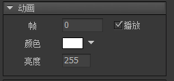

## 创建动画

编辑器支持创建、编辑和使用序列帧动画。创建序列帧动画的方式有：

1. 使用Adobe Animate CC/Flash等动画编辑工具制作好动画，导出带plist或eas扩展名的描述文件以及相关的贴图（应放置在相同目录），然后将描述文件（仅描述文件，不是贴图）拖入编辑器即可生成动画素材。

2. 点击菜单“资源”->"新建动画"，或者点击主工具栏按钮，可以创建一个新的空白动画。然后在动画编辑界面点击“导入图片序列”，导入多张图片。

3. 直接拖入一个GIF文件到编辑器，GIF会自动转换为序列帧动画。

4. Flash项目支持直接导入和使用SWF文件。

无论从何种方式创建的动画，在编辑器里，动画素材都是以一个单一文件存在（扩展名为jta）。也就是说，无论动画是从库里的图片文件创建的，还是从外面导进来的，都不会再有对单个图片的依赖。例如，如果你是从资源库里拖图片进入动画编辑器创建动画的，创建完成后，这些图片与动画再没有任何关系。如果你要设置动画所在的纹理集，在动画编辑器里对动画进行设置，对那些图片设置是无效的。

## 编辑动画

在资源库中，或者舞台上，双击动画，进入动画属性设置对话框：


- `帧频` 可选24、30和60。可根据源动画的设定进行修改。
- 
- `播放间隔` 每隔多少帧播放一张图片。增大或减少这个值可以降低或者增加动画播放的速度。

- `循环延迟` 当动画播放结束后，停留多少帧再重新开始播放。

- `本帧延迟` 播放当前帧后停留多少帧再继续播放。

- `摆动式播放` 默认的播放形式是从第一帧播放到最后一帧，然后下个循环又从第一帧播放到最后一帧。如果勾选了摆动式播放，则先从第一帧播放到最后一帧，再从最后一帧倒序播放回第一帧，依此循环。
 
- `纹理集` 设置改动画发布到哪一张纹理集。**动画不支持纹理分页，也就是说，当纹理设置了自动分页时，如果动画被分布到不同的纹理集页面，就会出现显示错误。这时你可以安排动画单独纹理集，或者和其他动画放在一个纹理集上。**

- `导入图片序列` 从序列图片中更新动画。

- `导入Sprite表` 导入Adobe Animate CC或者其他动画工具导出的动画文件。

## 实例属性

在舞台上选中一个动画，右边的属性面板列表出现：



- `帧` 设置当前帧。

- `播放` 设置动画是否处于播放状态。

- `颜色` 修改动画各个颜色通道的值，使动画产生变色的效果。*（注：Egret、Laya版本目前是通过滤镜实现的，效率较低，不推荐使用此功能）。*

- `亮度` 调整动画的明暗。这个实际是通过修改`颜色`属性实现的，和设置颜色为灰阶颜色一样的效果。

## GMovieClip

动画我们一般不直接使用new来创建，也很少有需要单独创建动画的需求。它一般直接放置在其他组件中作为组成元素。如果确实需要实例化一个动画，可以使用以下方法：

```csharp
    GMovieClip aMovie = UIPackage.CreateObject("包名","动画名").asMovieClip;
```

常用的API有：

```csharp
    aMovie.playing = false; //切换播放和停止状态
    aMovie.frame = 5; //如果动画处于停止状态，可以设置停止在第几帧
```

对动画进行循环播放的设置，例如从第几帧播放到第几帧，循环播放多少次等：

```csharp
    aMovie.SetPlaySettings(0, -1, 0, -1); 
```

对动画播放过程的控制，可以使用PlayState对象：

```csharp
    //返回播放头部
    ((MovieClip)aMovie.displayObject).playState.reset();
```

动画播放完成可以获得一个回调通知：（如果是循环播放，则所有循环结束后才算播放完成）

```csharp
    //Unity
    aMovie.onPlayEnd.Add(...);

    //AS3
    aMovie.setPlaySettings(..., callback);

    //Egret
    aMovie.setPlaySettings(..., callback, this);

    //Laya
    aMovie.setPlaySettings(..., Handler.create(callback, this));
```
