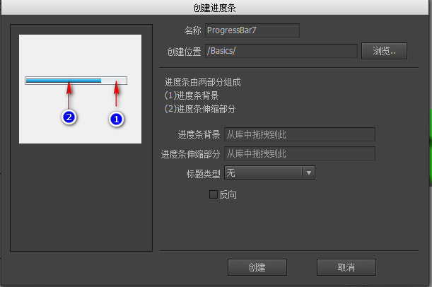

进度条的原理很简单，就是按进度改变一个元件的宽度、高度或填充比例。进度条分为两种，横向和纵向的。

## 创建进度条

可以通过两种方式创建进度条组件。

- 点击主菜单“资源”->“新建进度条”，然后按照向导的提示一步步完成。



- 新建一个组件，然后在组件属性里选择扩展为“进度条”。

## 设计属性

在组件编辑状态下，进度条组件的属性面板是：


- `标题类型` 如果组件内有名称为“title”的元件，则进度条可以显示一个表达当前进度的文字。
 - `百分比` 显示当前进度的百分比，例如“88%”。
 - `当前值/最大值` 例如“50/100”。
 - `当前值` 例如“50”。
 - `最大值` 例如“10000”。

- `反向` 
对于横向的进度条，一般来说，进度越大，伸缩条越向右延伸，如果是反向的，则伸缩条右边缘固定，进度越大，伸缩条越往左延伸。
- 
对于纵向的进度条，一般来说，进度越大，伸缩条越向下延伸，如果是反向的，则伸缩条底边缘固定，进度越大，伸缩条越往上延伸。

比较以下两个进度条，第一个是正常的进度条，第二个是反向的。


**命名约定**

- `bar` 当进度改变时，改变“bar”对象的宽度。一般用于横向的进度条。注意：一定要设置bar对象的宽度为进度条处于最大值时的宽度。

“bar”元件可以是任何类型，不限制于图片。

特别的，如果“bar”对象是具有特殊填充模式的图片或者装载器，进度改变时，将改变它的填充比例，而不是宽度。
 
- `bar_v` 当进度改变时，改变“bar_v”对象的高度。一般用于纵向的进度条。注意：一定要设置bar_v对象的高度为进度条处于最大值时的高度。

“bar_v”元件可以是任何类型，不限制于图片。

特别的，如果“bar_v”对象是具有特殊填充模式的图片或者装载器，进度改变时，将改变它的填充比例，而不是宽度。

- `title` 可以是装载器，也可以是标签、按钮。用于显示进度的标题。显示的内容由“标题类型”决定。

- `ani` 是一个动画对象。当进度改变时，修改动画的帧索引等于进度值（0-100）。

可以利用关联做出效果更丰富的进度条组件，例如下面这个进度条，会动的小松鼠建立了一个和bar部件“右->右”的关联，这样当进度变化时，小松鼠也跟着动了。


## 实例属性

在舞台上选中一个进度条组件，右边的属性面板列表出现：


- `当前值` 当前进度。

- `最大值` 最大进度值。

## GProgressBar

```csharp
    GProgressBar pb = gcom.GetChild("n1").asProgress;
    pb.value = 50;

    //如果想改变进度值有一个动态的过程
    pb.TweenValue(50, 0.5f);
```
