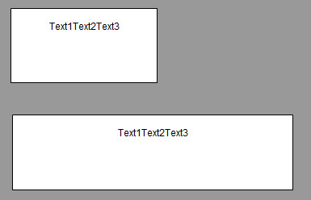
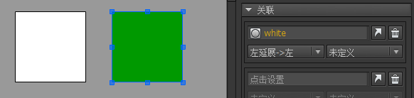
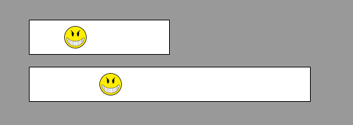
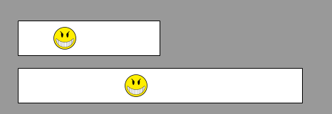

关联系统是FairyGUI实现自动布局的核心技术。其他UI框架提供的布局系统，一般只提供各种固定的layout，或者锚点，都只能定义元件与容器之间的关系。而FairyGUI的关联能够定义任意两个元件的关系，而且互动方式更多样。

## 设置关联

选定一个元件，可以看到在右边的属性栏出现了关联面板：


关联的目标可以是当前容器中的任意一个元件，也可以是正在编辑的容器本身（称为容器组件）。
如果要设置的目标是容器组件，则点击就能快速完成设置，如果是其他元件，则点击“点击设置”就可以进入到选择目标元件的界面，这时我们就可以从左边的编辑区域选择目标对象，如果点击舞台的空白处，则选择的是容器组件。选择结束后，点击“完成”完成设置。


目标对象设置好后，就可以设置自己和目标的关联关系。有两个下拉框可以进行这种选择。左右两个下拉框是相同功能的，每个目标你可以设置一个或两个关联关系（如果两个不够，就在下面的关联子面板继续选择这个目标）。FairyGUI支持设置任意数量的关联目标。


关联关系的类型有：（为论述方便，这里假设自己是A，目标元件是T）

- `左->左` 假设原来T和A的左侧距离是X，当T的左侧位置变化时，保持T和A的左侧距离为X。注意：与容器组件关联左->左是没有意义的，因为元件在容器中，而容器组件的位置变化是整个容器的移动，并不会影响容器内部所有元件的坐标。

- `左->中` 假设原来T的中心点和A的左侧距离是X，当T的中心点发生位移时，保持T的中心点和A的左侧距离为X。这里T的中心点发生位移有两种情况，一是T发生位移，二是T的宽度增大。

举例说明，下面的文本是自动增大的，图标与文本建立了一个左->中的关联，所以当文字变化时，图标保持在了文本的中心：


注意：关联只有在目标的位置或大小发生变化时才起作用。比如上例，设置图标关联文本的左->中，并不意味着就是居中，图标的初始位置是要自己设置的。这是初学者比较容易犯的错误。再强调一下，它只是保持T的中心点和A的左侧距离。那么看下面这个示范：


依然是建立的左->中关联，这次我们把图标往左挪动了一点，可以看到，文本长度发生变化后，图标的位置与文本中线的位置保持不变。

- `左->右` 假设原来T的右侧和A的左侧距离是X，当T的右侧发生位移时，保持T的右侧和A的左侧距离为X。这里T的右侧发生位移有两种情况，一是T发生位移，二是T的宽度增大。咋一看，似乎和左->中没有区别，但在复杂的应用场景中，左->右有发挥作用的空间。举例说明：


这里有一个左右居中的关联，下面会说明，暂且不表。置可以看到，在文本内容发生变化时，文本的中线位置没有发生变化，位所以问号图标的置不变；但文本的右侧位发生了变化，所以叹号图标随之发生了移动，保持了与文本右侧的距离。

- `左右居中` 假设原来T的中心和A的中心距离是X，当T的中心发生位移时，保持T的中心和A的中心距离为X。这里T的中心发生位移有两种情况，一是T发生位移，二是T的宽度增大。举例说明：



文本建立了一个与容器组件的左右居中关联，可以看到，当组件变宽时，文本依然保持了中间的位置。这里再提醒一次，左右居中关联并不等同与居中，文本可以放置在任何位置。关联只是保证中线距离一直不变。

- `右->左` 假设原来T的左侧和A的右侧距离是X，当T的左侧发生位移时，保持T的左侧和A的右侧距离为X。”右“系列的关联还有一个特点，就是如果A的宽度发生改变时，A也会自动移动以保持X不变。举例说明：


这里文本建立了一个与问号图标的右->左关联，当文本内容发生变化时，文本的宽度发生了变化，正常来说，宽度发生变化后文本应该向右侧伸展，但为了保持文本的右侧与问号左侧距离不变，文本自动向左延伸，提示：本例中文本与容器组件建立一个右->左关联也是同样效果的。

- `右->中` 假设原来T的中心和A的右侧距离是X，当T的中心发生位移时，保持T的中心和A的右侧距离为X。

- `右->右` 假设原来T的右侧和A的右侧距离是X，当T的右侧发生位移时，保持T的右侧和A的右侧距离为X。

- `左延展->左` 假设T的左侧和A的左侧的距离是X，当T的左侧发生位移时，A的左侧会发生移动，但保持A的右侧不变，也就是A产生一个延展（宽度变化）的效果。举例说明：



绿色方块建立了一个与白色方块左延展->左的关联。


当白色方块向左移动时，绿色方块的左侧跟随白色方块移动，但绿色方块的右侧保持不动，效果就是绿色方块被拉长了。

- `左延展->右` 假设T的右侧和A的左侧的距离是X，当T的右侧发生位移时，A的左侧会发生移动，但保持A的右侧不变，也就是A产生一个延展（宽度变化）的效果。

- `右延展->左` 假设T的左侧和A的右侧的距离是X，当T的左侧发生位移时，A的右侧会发生移动，但保持A的左侧不变，也就是A产生一个延展（宽度变化）的效果。

- `右延展->右` 假设T的右侧和A的右侧的距离是X，当T的右侧发生位移时，A的右侧会发生移动，但保持A的左侧不变，也就是A产生一个延展（宽度变化）的效果。右延展->右一般也用来做容器的自动扩展。举例说明：


这里容器组件设置了一个对文本的右延展->右关联（设置容器组件的关联的方法是点击编辑器区域的空白处，也就是不要选中任何元件，右侧就会出现容器组件的关联设置），这表示当文本扩展时，容器组件的宽度随之增大。


当容器组件建立了对文本右延展的关联后，容器组件的宽度就由文本的宽度决定了。所以当这个组件被拖到其他地方使用时，它的宽度就无法手工改变了，拉大拉小或者直接输入宽度都没有作用。

- `宽->宽`
假设T的宽度和A的宽度的差是X，当T的宽度发生变化时，A的宽度发生相同的变化。举例说明：


背景图片与容器组件建立了宽->宽关联。


现在我们把制作好的组件拿出来使用，可以看到，当组件被拉宽时，图标的宽度也随之被拉宽。如果我们没有设置关联，那么效果是这样的：


- `顶->顶` `顶->中` `顶->底` `上下居中` `底->顶` `底->中` `底->底` `顶延展->顶` `顶延展->底` `底延展->顶` `底延展->底` `高->高` 这些关联的设置方法和特性都和上述的关联相同，只是从横向变成纵向而已，在此不再赘述。

- `使用百分比` 从上面的论述可以看到，关联总是在保持设定好的距离，这个距离是绝对距离，是像素的距离。有时候我们需要的是成比例的距离。FairyGUI提供了这样一个功能，在设置关联时，可以使用比例距离。举例说明：


笑脸图标增加了一个到容器组件的“左->中”关联，并勾选”使用百分比“。容器组件的宽度是200像素，现在笑脸图标的x坐标是50像素。也就是说，问号图标在容器组件的1/4位置，与容器组件的中心距离也是1/4的宽度。



现在把设计好的组件拖出来使用，上面的是原来的宽度，200像素，下面把组件的宽度拉长为400像素。可以看到，笑脸图标依照左->中的关联规则发生了位移，它现在所在的位置是100像素，仍然保持了与容器组件中心距离1/4的宽度。

现在我们对比一下不勾选”使用百分比“的结果。在200像素的原大小下，问号图标于容器组件中心的位置距离是50像素。当下面的组件宽度变大后，问号图标与容器组件中心的位置依然是50像素。



## Relation

除了在编辑器设置关联外，有时候我们也需要动态添加关联。例如在一款页游中，一个动态添加到舞台的组件，希望舞台宽度改变时（比如浏览器窗口被玩家拖大拖小），组件依然保持在右侧位置，那么可以这样调用：

```csharp
    aObject.AddRelation(GRoot.inst, RelationType.Right_Right);
```

又例如，一个动态添加到舞台的组件始终保持满屏大小，可以这样调用

```csharp
    aObject.SetSize(GRoot.inst.width, GRoot.inst.height);
    aObject.AddRelation(GRoot.inst, RelationType.Size);
```

RelationType.Size相当于RelationType.Width_Width和RelationType.Height_Height的组合。这里强调一下，使组件变为满屏大小这个操作必须由你完成，也就是上面代码中的SetSize调用。关联并不能完成这项任务，因为关联是不管元件当前的大小的，它只会在目标变化时保持两者大小的差别。

删除关联的方法是：

```csharp
    //删除某个关联
    aObject.RemoveRelation(targetObject, RelationType.Size);

    //删除指向某个对象的所有关联
    aObject.relations.ClearFor(targetObject);
```

## 实例解析

1. 这是一个游戏的主界面，主界面在实际显示时通常需要调整大小到满屏，这就要求设计时考虑到界面大小会变化的情况。下图是主界面中各个单独部件布局的要求：


A：和容器组件“左右居中“关联
B：和容器组件”右->右”关联
C：和容器组件“右->右”，”底->底“关联
D：和容器组件”底->底”，“左右居中%”关联
E：和容器组件“底->底”关联

然后运行时把这个界面设置为满屏就可以了。

```csharp
    aComponent.SetSize(GRoot.inst.width, GRoot.inst.height);
    //当屏幕改变时仍然保持全屏。如果屏幕大小始终不变，则这句也可以忽略
    aComoponet.AddRelation(GRoot.inst, RelationType.Size);
```

2. 这是一个游戏的NPC信息界面，NPC的介绍文本是动态的，这里使用了自动高度的文本。下面的链接是一个列表。要求列表在文本内容变化时，自动上移或下移。我们只需要将列表“顶->底”关联到文即可。


3. 这是一个游戏中金钱数量的显示，要求当数量变化时，货币图标和文本保持居中。


首先，文本需要设置为自动宽度和高度，这样数量变化时，文本自动会增长。
用到的关联有：
文本：左右居中关联到容器组件
图标：左->左关联到文本
