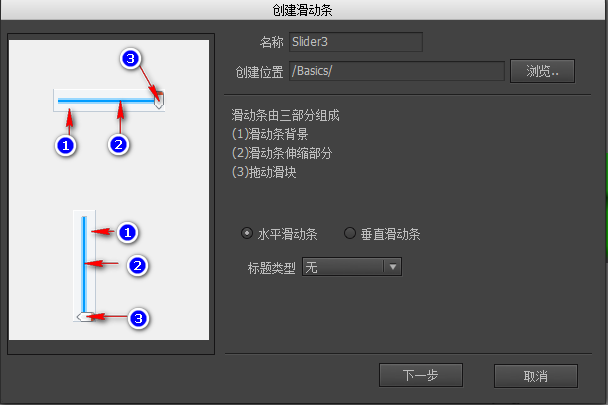

滑动条与进度条相似，不过滑动条增加了一个“把”按钮可以让玩家拖动它改变进度条的值。

## 创建滑动条

可以通过两种方式创建滑动条组件。

- 点击主菜单“资源”->“新建滑动条”，然后按照向导的提示一步步完成。



- 新建一个组件，然后在组件属性里选择扩展为“滑动条”。

## 设计属性

在组件编辑状态下，滑动条组件的属性面板是：


- `标题类型` 如果组件内有名称为“title”的元件，则进度条可以显示一个表达当前进度的文字。
 - `百分比` 显示当前进度的百分比，例如“88%”。
 - `当前值/最大值` 例如“50/100”。
 - `当前值` 例如“50”。
 - `最大值` 例如“10000”。

- `反向` 对于横向的滑动条，一般来说，进度越大，伸缩条越向右延伸，如果是反向的，则伸缩条右边缘固定，进度越大，伸缩条越往左延伸。
- 
对于纵向的滑动条，一般来说，进度越大，伸缩条越向下延伸，如果是反向的，则伸缩条底边缘固定，进度越大，伸缩条越往上延伸。

**命名约定**

- `bar` 当进度改变时，改变“bar”对象的宽度。一般用于横向的进度条。注意：一定要设置bar对象的宽度为进度条处于最大值时的宽度。

“bar”元件可以是任何类型，不限制于图片。

- `bar_v` 当进度改变时，改变“bar_v”对象的高度。一般用于纵向的进度条。注意：一定要设置bar_v对象的高度为进度条处于最大值时的高度。

“bar_v”元件可以是任何类型，不限制于图片。

- `grip` 用于拖动的按钮。注意：grip按钮应该与bar对象建立一个关联，并放置在进度条处于最大值时的位置。

- `title` 可以是装载器，也可以是标签、按钮。用于显示进度的标题。显示的内容由“标题类型”决定。
 
## 实例属性

在舞台上选中一个滑动条组件，右边的属性面板列表出现：


- `当前值` 当前进度。

- `最大值` 最大进度值。

## GSlider

```csharp
    GSlider slider = gcom.GetChild("n1").asSlider;
    slider.value = 50;

    //默认情况下除了拖动grip改变进度外，还可以直接点击滑动条任意位置改变进度。
    //如果不需要，可以用下面的API关闭
    slider.changeOnClick = false;
```

滑动条进度改变时有通知事件：

```csharp
    //Unity
    slider.onChanged.Add(onChanged);

    //AS3
    slider.addEventListener(StateChangeEvent.CHANGED, onChanged);

    //Egret
    slider.addEventListener(StateChangeEvent.CHANGED, this.onChanged, this);

    //Laya
    slider.on(fairygui.Events.STATE_CHANGED, this, this.onChanged);
```