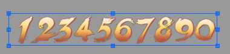
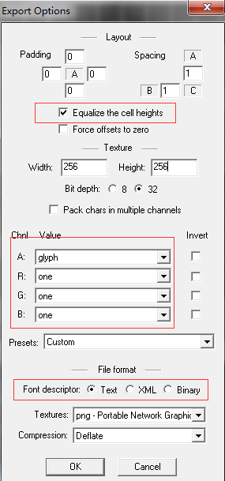
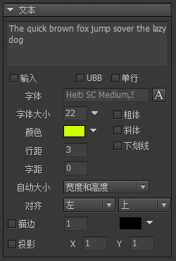

文本是FairyGUI的一种基础控件。

## 动态字体

动态字体(Dynamic Font)是指直接使用ttf字体渲染文字。ttf字体文件可能存在于系统中，也可能打包在游戏中。

FairyGUI编辑器运行的环境，与应用实际运行的环境是不相同的。比如你在PC上制作界面，最终界面可能运行在手机上。在编辑界面时，动态字体是使用FairyGUI使用编辑器所在的系统环境的字体，在运行时，则是由实际的运行环境，例如Android系统等提供的字体。设计时的字体可以与运行时的字体不同，但建议选取效果较为相近的。

设置编辑器使用的字体可以在项目属性里设置。运行时的字体则需要由代码设置：

```csharp
    //Droid Sans Fallback是安卓上支持中文的默认字体
    UIConfig.defaultFont = 'Droid Sans Fallback'; 
```

设置运行时使用的字体需保证该字体在目标平台上也存在，否则达不到想要的效果。

如果要在编辑器里使用ttf字体，请双击ttf文件，确认安装到系统，这样重启编辑器后就可以在字体列表里看到这种字体了。

## 位图字体

在游戏中经常有这样的设计：一些表达特别元素的字符，使用了图片来制作，例如：



FairyGUI编辑器支持位图字体。首先，我们创建一种字体。点击菜单“编辑”->“创建位图字体”，然后，弹出了字体编辑窗口，我们从资源库里把制作好的数字图片拖入到窗口，并设置每个图片对应的字符，点击保存，这样我们的字体就设置好了。如果要修改每个字符对应的图片，将图片重新拖入即可。

使用图片代替字符的办法，对于少量文本，这是非常方便的，但如果需要嵌入成百上千字，为每个字制作为图片，然后再每个设置对应字符，这工作量就有点大了。FairyGUI编辑器支持外部的位图字体制作工具BMFont、ShoeBox等，这些工具的使用方法请自行参考网络资料。使用外部工具最后会导出一个fnt文件**（注意1：文件格式应该选择fnt格式，不支持xml或者json）**，在编辑器点击导入素材，然后选择这个fnt文件，就可以把字体导入到编辑器里了。

以下是推荐的BMFont导出设置：



以下介绍位图字体设置界面的功能：


- `图片` 资源库里一张图片的名字。如果是由BMFont导入的字体，则此栏为空。

- `字符` 该图片对应的字符。

- `偏移X` 在水平方向上该字符的偏移。

- `偏移Y` 在垂直方向上该字符的偏移。负数表示字符上移，整数表示字符下移，但因为文字排版都是基线对齐，下移的结果可能是整行都发生下移。

- `占位` 一般来说，一个字符的水平占位宽度是由字符图片的宽度决定的。如果这里的数值不为0，则使用该值作为字符的水平占位宽度。

- `字体大小` 位图字体的字号。在勾选“允许动态改变字号”后有效。

- `默认占位` 统一设置所有字符的默认水平占位宽度。

- `允许动态改变字号` 勾选后，使用这个字体的文本可以设置字体大小使字符图片缩放。例如，先设置位图字体的“字体大小”为12，然后文本设置里设置字号为24，那么最终位图字体将放大一倍显示。如果这里不勾选，那么无论文本设置里字号为多少，位图字体都保持原样，不进行缩放。

- `允许动态改变颜色` 勾选后，使用这个字体的文本可以设置字符图片的颜色。这个改变颜色类似于改变图片元件颜色的功能。*（注：Egret、Laya版本目前不支持该特性）。* 如果不勾选，那么无论文本设置里文本的颜色是什么，位图字体都保持原来的颜色。

- `纹理集` 如果字体是从BMFont导入的，那么字符图片都在一张贴图上，这里对应的是贴图资源。仅作展示，不可修改。如果你要设置该字体最终发布到哪张纹理集上，那么应该进入这个贴图图片的设置窗口设置。

## 实例属性

点击主工具栏中的按钮，生成一个文本元件。



- `文本` 设置文本内容。当需要换行时，在编辑器里可以直接按回车。运行时需要换行可以用“\n”，尽量避免使用“\r\n”。

- `字体` 设置文字使用的字体。你不需要每个文本设置一次字体。在项目属性里可以设置项目中所有文本默认使用的字体。运行时则通过UIConfig.defaultFont统一设置。如果某些文本确实需要指定特别的字体，可以点击右边的A按钮，选择其他字体，或者直接输入字体名称。如果需要使用位图字体，可以从资源库中把字体资源拖动到这里。

- `字体大小` 设置文字使用的字号。如果使用的是位图字体，你需要对位图字体设置“允许动态改变字号”，这里的选项才有效。

- `颜色` 设置文字颜色。如果使用的是位图字体，你需要对位图字体设置“允许动态改变颜色”，这里的选项才有效。

- `行距` 每行的像素间距。

- `字距` 每个字符的像素间距。

- `自动大小` 
  - `自动宽度和高度` 文本不会自动换行，宽度和高度都增长到容纳全部文本。
  - `自动高度` 文本使用固定宽度排版，到达宽度后自动换行，高度增长到容纳全部文本。
  - `自动收缩` 文本使用固定宽度排版，到达宽度后文本自动缩小，使所有文本依然全部显示。如果内容宽度小于文本宽度，则不做任何处理。*(位图字体要在字体属性里勾选'允许改变字号'才能使用自动收缩特性)*
  - `无` 文本使用固定宽度和高度排版，不会自动换行。超出文本框范围的被剪裁。*（Laya、Egret、Unity平台没有开启此剪裁功能，也就是超出范围的依然会显示）*

- `对齐` 设置文本的对齐。

- `粗体` 设置文本为粗体。

- `斜体` 设置文本为斜体。

- `下划线` 设置文本为下划线。*（Laya平台不支持下划线）*

- `单行` 设置文本为单行。单行文本不会自动换行，换行符也被忽略。

- `描边` 设置文本的描边效果。描边效果在各个引擎实现方式不相同：
  - AS3/Starling 使用滤镜的方式实现；
  - Egret/Laya 使用H5引擎自身提供的功能；
  - Unity 使用额外的Mesh模拟描边效果。一般一个字符的Mesh含有4个顶点（两个三角形），使用描边效果后则增加到20个顶点（十个三角形）。

- `投影` 设置文本的投影效果。投影效果可以看做是简化的描边效果，描边是所有方向，投影只有一个方向。

- `UBB` 设置文本支持UBB语法。使用UBB语法可以使单个文本包含多种样式，例如字体大小，颜色等。请参考[UBB语法](#UBB语法)。*（Laya版本不支持普通文本里包含多种样式，如果有这个需求，请改用富文本）*

- `输入` 设置文本用于输入。勾选后，点击选项旁边的按钮弹出输入类型文本的详细设置：

<center>

</center>

- `最大长度` 允许输入的最大字符数量。0表示不限制。

- `密码` 勾选后，输入的字符将显示成“*”号。

- `输入限制` 限制用户输入的字符。一般只用在PC上。这里，不同平台的语法不一致。
  - `AS3/Starling` 参考资料 [TextField.restrict](http://help.adobe.com/zh_CN/FlashPlatform/reference/actionscript/3/flash/text/TextField.html#restrict)。
  - `Egret` 参考资料 [TextField.restrict](http://developer.egret.com/cn/apidoc/index/name/egret.TextField#restrict)。
  - `Laya` 参考资料 [Input.restrict](https://layaair.ldc.layabox.com/api/?category=Core&class=laya.display.Input#restrict)。
  - `Unity` 参考资料 [正则表达式语法](https://msdn.microsoft.com/zh-cn/library/az24scfc.aspx)。例如限制只能输入数字的表达式是：“[0-9]”。

- `键盘类型` 设置在手机上输入时，弹出的手机键盘的类型。

- `提示文字` 设置输入文本内容为空时的显示内容，一般用来提示用户这里应该输入什么。这个提示文字可以设置单独的颜色或其他样式，方法是使用UBB语法，例如“[color=#CCCCCC]提示文字[/color]”。*（Egret和Laya版本不支持提示文字使用UBB语法）*


## GTextField

文本支持动态创建，例如：

```csharp
    GTextField aTextField = new GTextField();
    aTextField.SetSize(100,100);
    aTextField.text = "Hello World";
```

在Unity平台中，如果你需要改变文本的样式，请使用以下的方式：

```csharp
    TextFormat tf = aTextField.textFormat;
    tf.color = ...;
    tf.size = ...;
    aTextField.textFormat = tf;
```

如果要设置文本的字体为位图字体，字体名称直接使用字体的url就可以了，例如‘ui://包名/字体名’。

## GTextInput

如果文本勾选为“输入”，则运行中的实例对象为GTextInput。

可以通过UIConfig.inputHighlightColor和UIConfig.inputCaretSize修改光标的颜色和大小。注意，输入光标的大小会自动根据屏幕缩放选择最合适的宽度，一般情况下你不需要修改。

输入文本在文本改变时有通知事件：

```csharp
    //Unity
    aTextInput.onChanged.Add(onChanged);

    //AS3
    aTextInput.addEventListener(Event.CHANGE, onChanged);

    //Egret
    aTextInput.addEventListener(Event.CHANGE, this.onChanged, this);

    //Laya
    aTextInput.on(laya.events.Event.INPUT, this, this.onChanged);
```

在获得焦点和失去焦点时有通知事件：

```csharp
    //Unity
    aTextInput.onFocusIn.Add(onFocusIn);
    aTextInput.onFocusOut.Add(onFocusOut);

    //AS3
    aTextInput.addEventListener(FocusEvent.FOCUS_IN, onFocusIn);
    aTextInput.addEventListener(FocusEvent.FOCUS_OUT, onFocusOut);

    //Egret
    aTextInput.addEventListener(FocusEvent.FOCUS_IN, this.onFocusIn, this);
    aTextInput.addEventListener(FocusEvent.FOCUS_OUT, this.onFocusOut, this);

    //Laya
    aTextInput.on(laya.events.Event.FOCUS, this, this.onFocusIn);
    aTextInput.on(laya.events.Event.BLUR, this, this.onFocusOut);
```

如果要主动设置焦点，可以用

```csharp
    aTextInput.RequestFocus();
```

如果输入文本设置了单行，则当按用户回车时会派发一个事件：

```csharp
    //Unity
    aTextInput.onSubmit.Add(onSubmit);
```

## UBB语法

FairyGUI支持的UBB语法有：

- `[img]image_url[/img]` 显示一个图片。这里的image_url可以是"ui://包名/图片名"的内部url格式，也可以是一个外部资源的url。图片最终是通过GLoader显示的，支持外部资源的能力可以参阅GLoader的文档。在这里，你无法设置图片大小。如果需要需要设置图片大小，改用HTML语法。

- `[url=link_href]text[/url]` 显示一个超级链接。其中link_href可以在链接点击后触发的事件里获得。

- `[b]text[/b]` 设置文本为粗体。

- `[i]text[/i]` 设置文件为斜体。

- `[u]text[/u]` 设置文本为下划线。

- `[sup]text[/sup]` 设置文本为上标。*（仅Unity平台支持，且在编辑器暂时无法预览）*

- `[sub]text[/sub]` 设置文本为下标。*（仅Unity平台支持，且在编辑器暂时无法预览）*

- `[color=#FFFFFF]text[/color]` 设置文本颜色。注意一定要用十六进制颜色代码，像red、blue这种颜色名称是不支持的。使用color语法还可以设置文本颜色为渐变色*（仅Unity平台支持，且在编辑器暂时无法预览）*，例如：

```csharp
    //指定两个颜色表示上下过渡
    [color=#FFFFFF,#000000]文字[/color]

    //指定四个颜色可以做左右过渡或者双方向过渡
    [color=#FFFFFF,#CCCCCC,#000000,#FFFF00]文字[/color]
```

- `[font=font_face]text[/font]` 设置文本的字体。

- `[size=10]text[/size]` 设置文本的字体大小。

- `[align=left/center/right]text[/align]` 设置文本的水平对齐。*（仅Unity平台支持，且在编辑器暂时无法预览）*

标签之间支持嵌套，但不支持交叉嵌套。例如：

```csharp
    //允许
    [color=#FFFFFF][size=20]text[/size][/color]

    //不允许
    [color=#FFFFFF][size=20]text[/color][/size]
```

对不支持的标签，例如“[tag]text[/tag]”，FairyGUI不做解析，这部分内容原样输出。当需要使用不成对的“[”或“]”字符时，可以使用HTML代码“&amp;#x5b;”或“&amp;#x5d;”代替。

普通文本不支持语法中的img、url标签，因为普通文本是不可以图文混排的。要支持图文混排，改为使用富文本。
 
FairyGUI也提供了扩展UBB解析器的方法。继承UBBParser类，注册自己的TagHandler即可。具体实现方法请阅读UBBParser的源码或参考demo。