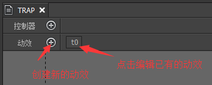
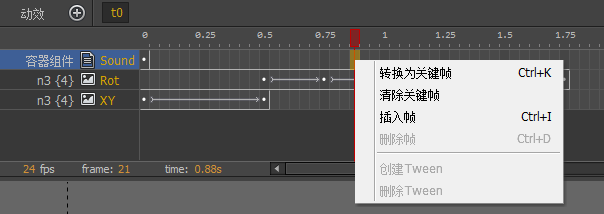
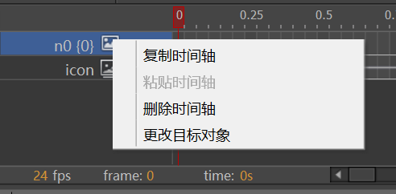
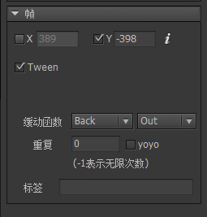

FairyGUI不仅提供了静态UI的编辑功能，而且提供了强大的动效编辑功能，让你的UI可以轻松动起来。

## 编辑动效



创建新动效或者点击以后动效后进入到动效编辑界面。

先了解几个概念：

- `时间轴` 元件一个属性的变化构成一条时间轴。例如一个组件，他的位置的变化可以成为一条时间轴。

- `帧` 时间轴由一个或多个帧做成。在动效中，我们固定使用每秒24帧的速率制作动画。

- `关键帧` 时间轴上有很多帧，但不是所有帧都可以调整元件的属性。可以调整元件属性的帧叫“关键帧”。其他普通帧是自动生成的过渡。关键帧与普通帧在显示上的区别是中心多了个白点：。

- `Tween` 在两个关键帧之间生成平滑动画效果。Tween的显示为：，即有一个箭头连接两个关键帧。

**创建时间轴**

选中一个元件后（或不选中任何元件，在舞台空白处右键），从右键菜单中创建时间轴：


不同的元件可以创建的类型有所不同。

- `改变位置` 改变元件的位置（x，y）。
- `改变大小` 改变元件的宽和高（width、height）。
- `改变透明度` 改变元件的透明度（alpha）。
- `改变旋转` 改变元件的旋转（rotation）。
- `改变缩放` 改变元件的缩放（scaleX，scaleY）。
- `改变倾斜` 改变元件的倾斜（skewX，skewY）。
- `改变颜色` 对图片、文字、装载器有效，改变它们的颜色（color）属性。
- `改变动画` 对动画、装载器有效，改变动画当前的播放状态（playing），或者设置当前帧（frame）。使用这个功能可以使动效轻松地和序列帧动画结合做复杂效果。
- `改变轴心` 改变元件的轴心（pivotX，pivotY）。一般来说，轴心应该设置为元件的固定属性，而不是在动效里临时改变。这里只是给出一个途径，使用的情景不多。
- `改变可见性` 改变元件的可见性（visible）。
- `播放动效` 对组件有效，播放该组件定义的一个动效。如果当前没有选中任何元件，则播放当前容器组件的一个动效。这可以实现类似于动效嵌套的功能。例如，如果动效中有一段效果是需要循环播放的，那我们可以把它做成单独一个动效，然后再用这里的方法嵌套进来。
- `播放声音` 播放一个音效。
- `播放震动` 元件显示一个震动效果。
- `改变颜色滤镜` 改变元件的颜色滤镜。

**时间轴操作**


- `单选` 鼠标左键点击一个帧。
- `多选` 按住CTRL可增加选择，按住SHIFT可选择一个范围。或者直接在空白处按下鼠标左键不松开然后移动选择一个范围。
- `拖动` 直接拖动选区到其他位置。如上面动图演示的一样啊。



- `转换为关键帧` 转换当前帧为关键帧。
- `清除关键帧` 将关键帧变成普通帧。
- `插入帧` 插入一个帧，快捷键是Ctrl+I，该帧后的关键帧都依次后移。
- `删除帧` 删除一个帧，快捷键是Ctrl+D，该帧后的关键帧都依次前移。
- `创建Tween` 在两个关键帧之间建立一个Tween。
- `删除Tween` 删除两个关键帧之间的Tween。



- `复制时间轴` 复制时间轴。
- `粘贴时间轴` 将复制的时间轴粘贴到选定的时间轴。源和目标应该具有相同的属性。
- `删除时间轴` 删除选定的时间轴。
- `更改目标对象` 修改时间轴的目标对象。

**动效属性设置**


- `忽略显示控制器影响` 勾选后，动效开始时所有参与此动效的元件不受显示控制器的控制，也就是不会被显示控制器隐藏。动效结束后恢复控制。
- `容器组件不可见时自动停止` 当组件移出舞台时，自动停止播放动效，节省CPU资源。
- `自动播放` 当组件被加到舞台时，自动开始播放动效。
- `重复次数` 自动播放的重复次数。
- `延迟` 自动播放的延迟。单位秒。
- `复制动效` 复制这个动效。点击复制后立刻生成一个完全一样的新动效。
- `删除动效` 删除这个动效。

**帧属性设置**



- `X` `Y` 修改关键帧的值。输入框前面的勾表示，如果不勾选，则不修改元件当前的属性值。

这里有一个关键点要注意。举个例子说明。当前元件的X是50，不勾选。动效结束时设置X为100，有勾选。则动效播放第一次时元件从50运动到100。动效播放第二次时，第一帧的X值是没有勾选的，也就是使用当前值，那就是100，那么动效的效果是从100运动到100，也就是看不到任何表现。这是动效的设计问题。这个勾选的功能一般只用在不参与动效的属性值。例如元件只做水平运动，那么可以不勾选Y，方便以后调整Y值时不影响动效。

- `Tween` 勾选后从这个关键帧到下一个关键帧建立一个Tween。如果没有下一个关键帧，那么这个Tween是无效的。

- `缓动函数` 时间/速度曲线。详细请参考 [图解](../../images/20170802000005.jpg) [示例](https://greensock.com/ease-visualizer)。
 
- `重复` 重复播放的次数。-1表示循环。

- `yoyo` 往返播放的效果。默认循环播放的效果是从起点到终点，然后又从起点到终点。勾选yoyo后，循环播放的效果是从起点到终点，再从终点到起点，依次类推。

- `标签` 设置帧的标签，一个任意的字符串，标识这个帧，用于代码里访问。

## Transition

动效的播放在代码中启动，例如：

```csharp
    Transition trans = aComponent.GetTransition(“peng”);
    trans.Play();
```

Play有多种原型，例如可以重复播放一定次数，可以在播放结束时回调等。例如：

```csharp
    //结束时有一个回调，但需注意，如果动效里有嵌套的动效，或者有循环的内容，必须是等全部都结束后才会回调。
    trans.Play(callback);
```

也可以倒着放，但要注意倒着放之前需要先执行一次正着放。例如：

```csharp
    trans.playReverse();
```

要中途停止动效的播放，可以调用：

```csharp
    trans.Stop();
```

Stop方法也可以带参数，原型是：

```csharp
    public void Stop(bool setToComplete, bool processCallback);
```

`setToComplete`表示是否将组件的状态设置到播放完成的状态，如果否，组件的状态就会停留在当前时间。`processCallback`是否调用Play方法传入的回调函数。

注意：UI动效播放完毕后，组件的状态将停留在最后一帧，而不是回到第一帧，如果你希望动效播放完后组件的状态复原到播放前，你需要最后添加一帧重新设置组件的状态。

如果需要修改某个关键帧的属性值，可以使用：

```csharp
    //例如某帧的标签为aa，这帧是设置某个元件的XY值的，将XY的数值改为100,200。
    trans.SetValue("aa", 100, 200);
```

可以修改某个Tween的持续时间，但修改某个Tween的时间**不会**使后续的Tween推迟。例如：

```csharp
    //修改某个Tween的持续时间为0.5秒。注意，标签应该定在Tween的开始关键帧上。
    trans.SetDuration("aa", 0.5f);
```

可以在动效运行到某帧时触发一个回调，例如：

```csharp
    //运行到标签为aa的关键帧时，触发一个callback的回调。
    trans.SetHook("aa", callback);
```

在Unity中，动效的播放速度是不受Time.timeScale影响的，但你可以单独设置动效的timeScale，例如：

```csharp
    trans.timeScale = 0.5f;
```