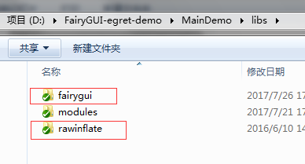

## Egret 4.x

1. 将FairyGUI库以及依赖的rawinflate库拷贝到libs目录。

  

2. 在index.html里添加上述两个库的引用。

  

  注：FairyGUI只依赖egret的core和res两个模块，不需要gui和eui。

3. 使用FairyGUI编辑器完成UI编辑。发布目录请选择Egret工程的resource/assets目录。发布后得到两个（或以上）文件。

  

4. 在default.res.json里，将上述的文件添加到定义中。扩展名为fui文件，类型请选择为bin。注意：Egret自动检测添加的资源，名称通常会自动加上下划线和后缀，例如basic.fui，名称自动设置为“basic_fui”，这里我们要手动将_fui去掉，名称只需要为“basic”。

  

  资源一般都加到preload组里，如果你是高阶玩家，也可以试试动态加载。确保在使用到相应的元件前加载好就行。

5. 在代码里完成规定的初始化，例如设定默认字体，滚动条等等。

  ```csharp
    /**
     * 创建游戏场景
     * Create a game scene
     */
    private createGameScene():void {
        fairygui.UIPackage.addPackage("basic");
        
        fairygui.UIConfig.defaultFont = "宋体";
        fairygui.UIConfig.verticalScrollBar = fairygui.UIPackage.getItemURL("Basic", "ScrollBar_VT");
        fairygui.UIConfig.horizontalScrollBar = fairygui.UIPackage.getItemURL("Basic", "ScrollBar_HZ");
        fairygui.UIConfig.popupMenu = fairygui.UIPackage.getItemURL("Basic", "PopupMenu");
        fairygui.UIConfig.buttonSound = fairygui.UIPackage.getItemURL("Basic","click");
        
        this.stage.addChild(fairygui.GRoot.inst.displayObject);

        this.mainPanel = new MainPanel();
   }
  ```

如果出现“fairygui not defined”的错误，请再一次检查index.html里是否有fairygui.js的引用。

## Egret 5.x

步骤与4.x的基本一样，不过需要额外的两个操作：

1. 复制一份rawinflate.min.js，并改名为rawinflate.js。
2. 在egretProperties.json文件中添加:

  ```csharp
    {  
        "name": "rawinflate",  
        "path": "./libs/rawinflate"  
    },  
    {  
        "name": "fairygui",  
        "path": "./libs/fairygui"  
    }
  ```
