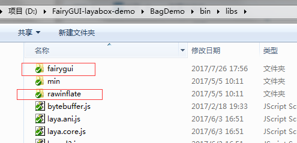

## TS/JS版本

1. 将FairyGUI库以及依赖的rawinflate库拷贝到bin/libs目录

  

2. 把fairygui.d.ts拷贝到libs目录。

  

3. 在index.html里添加上述两个库的引用，注意放置的位置。

  

  注：FairyGUI只依赖laya.core， laya.html两个模块，不需要laya.ui。

4. 使用FairyGUI编辑器完成UI编辑。发布目录请选择Laya工程的bin/res目录（当然其他目录也是可以的）。发布后得到两个（或以上）文件。

  

5. 在程序启动时（或者在需要用到这些UI的适当地方）加载这两个文件，并完成初始化。

  ```csharp
    // 程序入口
    class GameMain {
        constructor()
        {
            Laya.init(1136, 640, Laya.WebGL);
            laya.utils.Stat.show(0, 0);
            //设置适配模式
            Laya.stage.scaleMode = "showall";
            Laya.stage.alignH = "left";
            Laya.stage.alignV = "top";
            //设置横竖屏
            Laya.stage.screenMode = "horizontal";
            
            Laya.loader.load([{ url: "res/Basic@atlas0.png", type: Loader.IMAGE },
                { url: "res/Basic.fui", type: Loader.BUFFER }
            ], Handler.create(this, this.onLoaded));
        }
       
        onLoaded(): void {
            Laya.stage.addChild(fairygui.GRoot.inst.displayObject);
            
            fairygui.UIPackage.addPackage("res/Basic");
            fairygui.UIConfig.defaultFont = "宋体";
            fairygui.UIConfig.verticalScrollBar = "ui://Basic/ScrollBar_VT";
            fairygui.UIConfig.horizontalScrollBar = "ui://Basic/ScrollBar_HZ";
            fairygui.UIConfig.popupMenu = "ui://Basic/PopupMenu";
            fairygui.UIConfig.buttonSound = "ui://Basic/click";
            
            new MainPanel();
        }
    }
  ```

## AS版本

1. 从GITHUB中拉FairyGUI layabox SDK的源代码，放到你的源码工程里。
2. 在index.html里加入rawinflate.min.js，注意要放在你的js前。