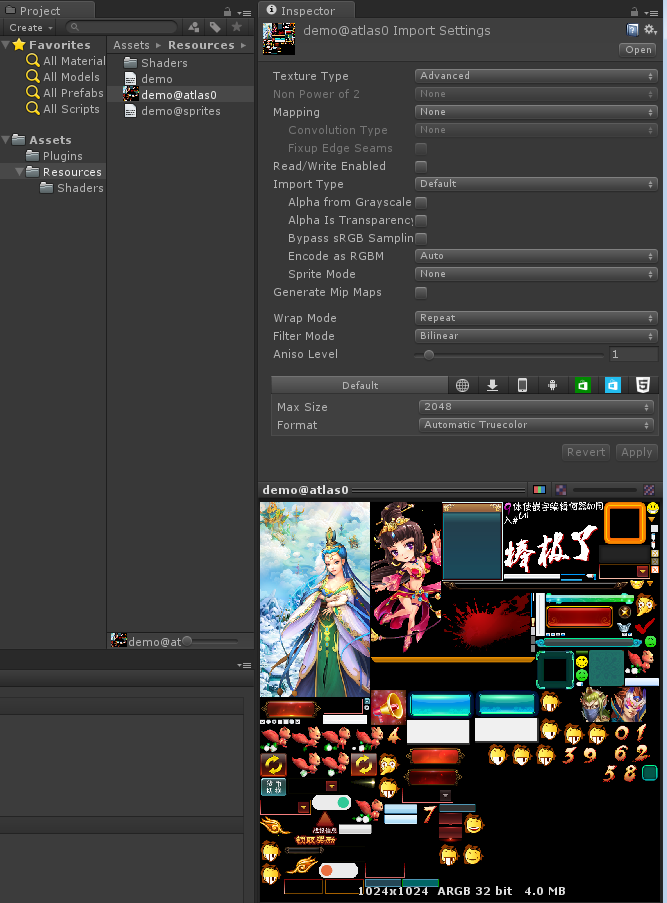
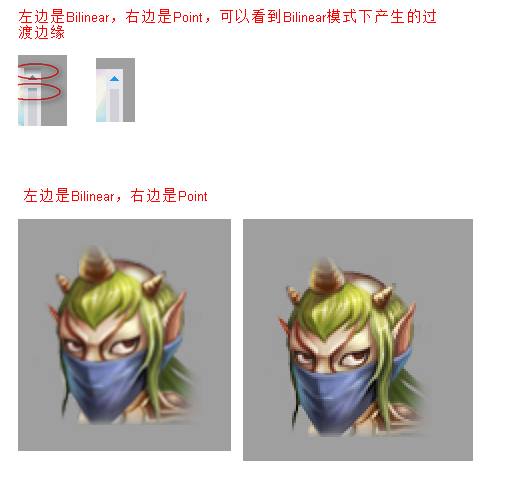

FairyGUI编辑器发布到Unity的资源通常包含一个或多个纹理集，以demo工程为例，这里demo@atlas0.png就是一个纹理集。

纹理集是由UI编辑器自动生成的，但在Unity里可以改变纹理集的属性，常用的设置有：

- `Texture Shape` 一定要选择为2D。**这个选项从5.5版本开始出现。如果不是2D，则出现UI图片都显示白色方块的问题。**

- `Generate Mip Maps` 不勾选。UI不使用Mip Maps功能。

- `Filter Mode` 使用Bilinear，这样图像在缩放时能产生比较平滑的过渡效果，副作用是会产生一定的模糊。而且单色的图像缩放会产生不必要的渐变边缘。而使用Point，则图像在缩放时会块状化。

一般使用Bilinear即可。你也可以在UI编辑器里将图片安排到不同纹理集，然后每个纹理集设置不同的Filter Mode以满足特殊需求。

- `Max Size` 一般设置到2048。

- `Format` UI的纹理集一般都是PNG格式，并带有透明通道。同时，UI对画质的要求比较高，所以建议选择AutoMatic TrueColor。但TrueColor有一个最大的问题是文件大，而且占用内存很高，例如1024×1024的图集，将占用4MB的内存，2048×2048则达到16MB。

如果对内存使用比较敏感，也可以选用压缩格式，即AutoMatic Compressed。在桌面平台上即相同于DXT5，在Android平台上相当于ETC1，在IPhone平台则为PVRTC。这些格式能够大大降低内存占用，也因为它们是显卡直接支持的格式，所以Unity在载入时省去了解码位图的步骤，能够加快载入速度。但它们都是属于有损压缩，在显示质量上肯定不如TrueColor，特别是纹理集颜色十分丰富或者有颜色渐变时，失真会比较厉害。特别重要的是，ETC1是不支持透明通道的，PVRTC对透明通道的支持也比较弱，所以并不适合带透明通道的图集。为此，FairyGUI提供了ETC1/PVRTC+A的解决方案。首先，在发布时勾选“分离Alpha通道”，如下图：

这样，就产生了两个不含透明通道的贴图，一张去除了原图透明通道的贴图，和一张将原贴图透明通道数值转换为等价灰度的贴图。这两张贴图都可以设置为Automatic Compressed。(一定要注意，不能再将主贴图设置为True Color)

FairyGUI提供了特制的着色器处理两张贴图的合并。开发者并不需要编写额外的代码就可以使用这项技术。

你可以将本身就不含透明通道的图片（例如一些大型的背景图）安排到一张纹理集上。如果一张纹理集内的所有图片都不包含透明通道，那么最终输出的图集也不包含透明通道。不含透明通道的图集可以选用Automatic 16bits格式。