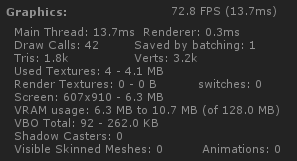
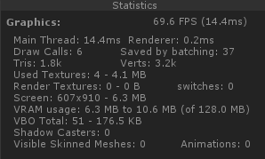

在Unity中，每次引擎准备数据并通知GPU的过程称为一次Draw Call（DC）。Draw Call次数是一项非常重要的性能指标。UI系统一般包含数量众多的物体，有效控制DC是衡量一个UI系统是否实用的关键因素，特别是在移动设备上。

我们先来看看NGUI是怎么做的，NGUI把UIPanel中的Widget按depth排序，然后将相同材质的Widget进行Mesh合并，例如使用相同图集的图片，或者文字。Mesh合并的优点是合并后这些Widget就只产生一个DC。但这个合并过程需要计算所有Widget坐标相对于Panel的变换，而且如果Widget行为改变，例如平移，缩放等，都会触发Mesh重新合并，这会带来一定的CPU消耗，这就需要开发者谨慎组织UI元素到各个UIPanel，并且对深度需要细致安排，否则达不到减少DC效果的同时更可能带来比较大的CPU消耗。

UGUI的原理大体也相似，Canvas和UIPanel是类似的，每个Canvas将优化为1个Mesh或多个SubMesh。

FairyGUI没有采取合并Mesh的策略，原因有：

- FairyGUI使用的是树状显示对象结构，各个元件之间的层次关系非常复杂；
- FairyGUI编辑器给予用户最大的设计自由度，加上动效的引入，各个元件的状态变化都非常频繁；

FairyGUI基于Unity的`Dynamic Batching`技术，提供了`深度调整技术`进行 Draw Call优化 。FairyGUI能在不改变最终显示效果的前提下，尽可能的把相同材质的物体调整到连续的RenderingOrder值上，以促使他们能够被Unity Dynamic Batching优化。Dynamic Batching是Unity提供的Draw Call Batching技术之一。如果动态物体共用着相同的材质，那么Unity会自动对这些物体进行批处理。但Dynamic Batching的一个重要的前提是这些动态物体是连续渲染的。先来看看FairyGUI中物体的渲染顺序，例如：


这里有4个按钮，每个按钮都是一个组件，每个组件里包含一个图片和一个文字对象。FairyGUI是树状的显示对象结构，那么他们按深度排序应该是：


因为文字和图片的材质并不相同，所以每次从文字到图片都产生上下文切换，所以产生了6个DC。
FairyGUI的深度调整技术可以优化这种情况。观察一下，其实四个按钮之间并不相交，所以FairyGUI智能地将渲染顺序调整为：


因为FairyGUI使用了图集，而且动态文字也使用了相同的贴图，这样，DC就降低到了2个，达到了优化的目的。实际情况会比这个复杂很多，但FairyGUI能在不改变最终显示效果的前提下，尽可能的把相同材质的物体调整到连续的RenderingOrder值上，以促使他们能够被Unity Dynamic Batching优化。而对开发者来说，这些底层上的调整是透明的，也就是不会影响原来的显示对象层次。从效率上考虑，这种技术仅比较物体之间的显示矩形区域（一个Rect）是否相交，所以速度是非常快的，不会带来过多的CPU负荷。

FairyGUI提供了一个开关控制组件是否启用深度调整，它就是`fairyBatching`，例如

```csharp
    aComponent.fairyBatching = true;
```

如果某个组件设置了fairyBatching，那么无需在子组件和孙子组件再启用fairyBatching。一般只在顶层组件打开这个功能，例如主界面，加载界面等。注意，Window这个类已经自动打开了fairyBatching，这符合我们的使用习惯，因为一般我们都是以窗口为单位安排功能的。如果界面不复杂，Draw Call本来就不高的情况下，开发者也可以忽略这个功能，从10个DC优化到8个DC并没有什么意义。

对于打开了fairyBatching的组件，当开发者自己调用SetPosition等API改变子元件或者孙子元件的位置、大小，旋转或缩放，并不会自动触发深度调整，例如一个图片原来显示在一个窗口里的顶层，你用Tween将它从原来的位置移到另外一个位置，这个图片就有可能被窗口里的其他元素遮挡。这时开发者需要手动触发深度调整，例如：

```csharp
    aObject.InvalidateBatchingState();
```

这个API并不需要由开启了fairyBatching的组件调用，aObject可以是任何一个内含的元件。并且你可以在任何时间调用，每帧调用也可以，只要你确认是需要。它的消耗不算大，但也不能说没有。

对于UI动效（Transitions），FairyGUI会在动效结束后自动调用这个API。如果动效过程中有对组件的大小或者位置进行改变，并且观察到组件的渲染顺序不正确，首先可以尝试调整动效的设计，避免出现组件之间重叠状态的改变，如果确实无法避免，那么还可以强制动效每帧都执行深度调整，例如：

```csharp
    aTransition.invalidateBatchingEveryFrame = true;
```

下载并运行Demo，可以观察fairyBatching的实际效果。例如这个Demo的首页：


设置了fairyBatching后由42个DC减少到了6个DC，另外，可以看到Saved by batching: 37的字样。




