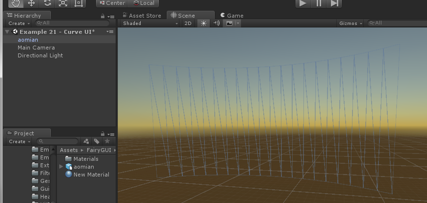
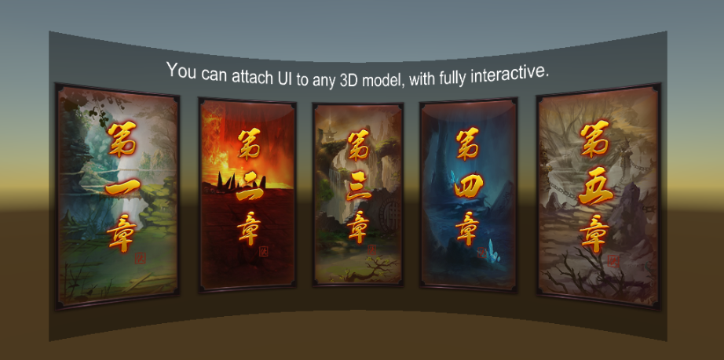

本篇教程介绍如何使用FairyGUI制作曲面UI。原理是将目标界面捕获到一张RenderTexture上，然后将这张Texture贴到一个曲面模型上，点击检测则使用MeshCollider完成。从这个原理也可以看出，FairyGUI不只可以支持曲面UI，而是任意形状的UI都支持，只要提供相应的模型即可。

## 制作曲面UI

首先将制作好的曲面模型放进场景里：

在模型的GameObject上挂一个`UIPainter`组件，这时应该会自动添加“Mesh Collider”组件和“Mesh Renderer”组件。

UIPainter和UIPanel的设置极为相似，设置好“Package Name”和“Component Name”后，对应的UI就能显示在曲面上了！

材质那里要注意选择一个着色器，如果不需要特别的效果，那选择“FairyGUI/Image”就可以，如果需要光照等需求，也选择其他着色器。（如果没有材质，自己新建一个材质）。

当曲面UI用于VR时，需要注意Stage Camera或者Capture Camera都**不可以**跟随眼睛移动，一般来说，使用高版本的FairyGUI SDK（如果使用的是dll版本，一定要注意和Unity的版本匹配），FairyGUI会自动设置好。如果出现显示问题，请检查一下相机的设置是否正确。

## UIPainter

- `Package Name` UI组件所在的包名称。注意，这里只是保存一个名称，并没有实际引用到任何UI数据。

- `Component Name` UI组件的名称。注意，这里只是保存一个名称，并没有实际引用到任何UI数据。

- `Sorting Order` 调整UIPainter的显示顺序。越大的显示在越前面。这个顺序是和UIPanel共用的。

- `Fairy Batching` 是否启用Fairy Batching。关于Fairy Batching请参考[这里](drawcall.html)。切换这个值，可以在编辑模式下实时看到DrawCall的变化（切换后点击一下Game，Stat里显示的内容才会更新），这可以使你更加容易决定是否启用这项技术。

- `Touch Disabled` 勾选后，将关闭点击检测。当这个UI没有可交互的内容时可以勾选以提高点击检测时的性能。

当使用曲面UI时，需要用到捕获UI成纹理的功能，所以需要定义VUI、Hidden VUI这两个Layer，否则会出现警告。这两个Layer可以随便定义到没使用的层序号，但要注意所有相机的Culling Mask都**不选择**这两个层。另外，运行时场景里会自动出现Capture Camera对象，这是正常的，不需要理会。